### 项目概述

这是一个基于Qt开发的桌面应用程序，用于管理培训机构或学校的学生信息、课程安排、财务记录和荣誉展示。

### 主要功能模块

#### 1. **学生管理** (StudentWidget)

- 学生信息的增删改查
- 支持学生照片上传
- 学生基本信息：姓名、性别、生日、入学日期、学习目标、进度等

#### 2. **课程安排** (ScheduleWidget)

- 周课程表管理
- 支持按年份和周数查看
- 双击单元格直接编辑课程
- 支持添加和删除课程
- 时间段：上午1-2、下午1-2、晚上1-2

#### 3. **财务管理** (FinancialWidget)

- 缴费记录管理
- 支持按学生姓名和日期筛选
- 数据可视化：饼图（支付类型分布）、折线图（缴费趋势）
- 支付类型：微信、支付宝、现金、银行卡

#### 4. **荣誉墙** (HonorwallWidget)

- 学生荣誉照片展示
- 支持添加荣誉记录和描述

#### 5. **系统设置** (Setting)

- 数据库路径配置
- 密码修改功能
- 记住密码设置
- 配置持久化存储

#### 6. **用户登录** (LoginDialog)

- 用户身份验证
- 支持记住密码功能
- 密码安全输入

### 核心架构

#### 数据层 (Database)

- 单例模式设计
- SQLite数据库管理
- 5个数据表：
  - `studentInfo` - 学生信息
  - `schedule` - 课程安排
  - `financialRecords` - 财务记录
  - `honorWall` - 荣誉墙
  - `users` - 用户账户

#### 界面层 (MainWindow)

- 采用QStackedWidget实现多页面切换
- 左侧导航栏 + 右侧内容区域
- 统一的样式表（style.qss）
- 响应式布局设计

#### 配置管理 (Setting)

- QSettings实现配置持久化
- 配置文件：`config/app.ini`
- 单例模式全局访问

### 项目实际界面介绍

#### 1.登录界面

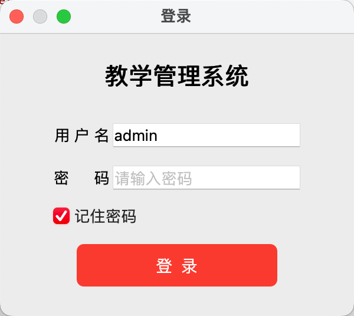 

#### 2.学生信息添加与删除

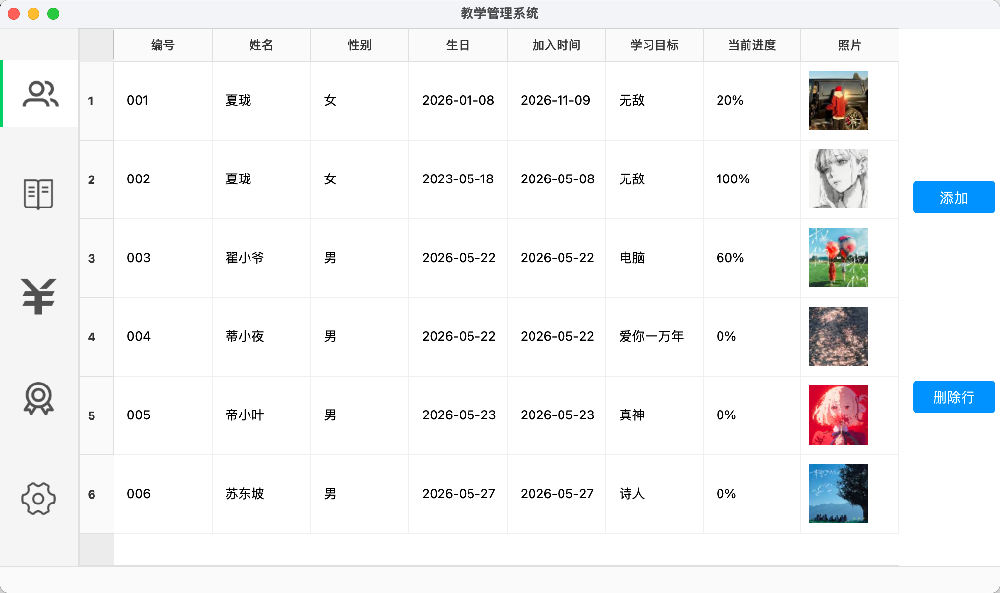

##### 2.1添加

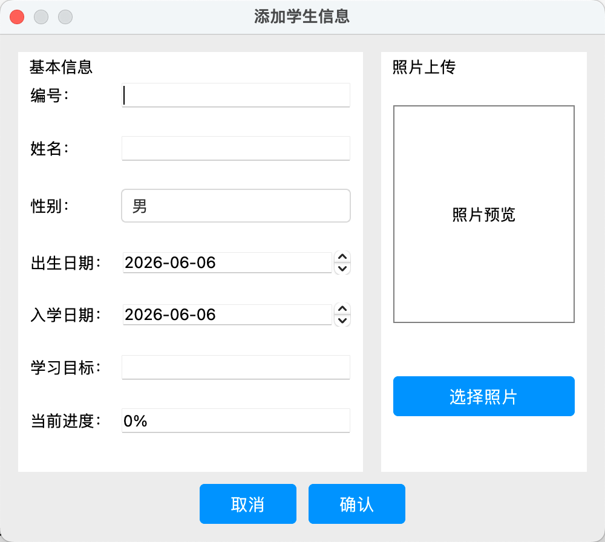

##### 2.2删除

选中对应行点击删除行可以直接删除，另外需要改对应列的内容双击即可(编号双击无法修改，以下是对应的头列表双击后的界面)

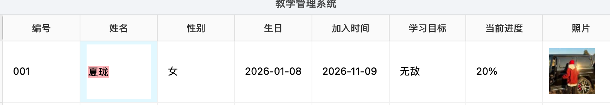

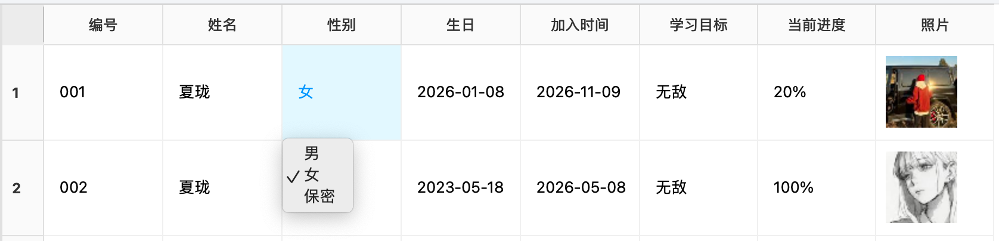

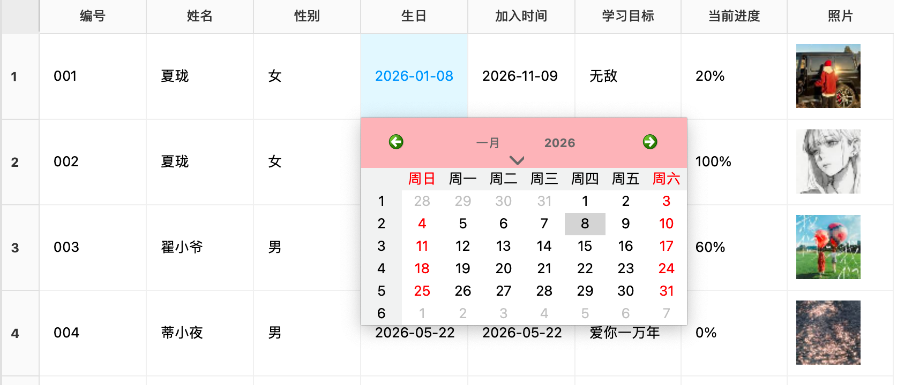

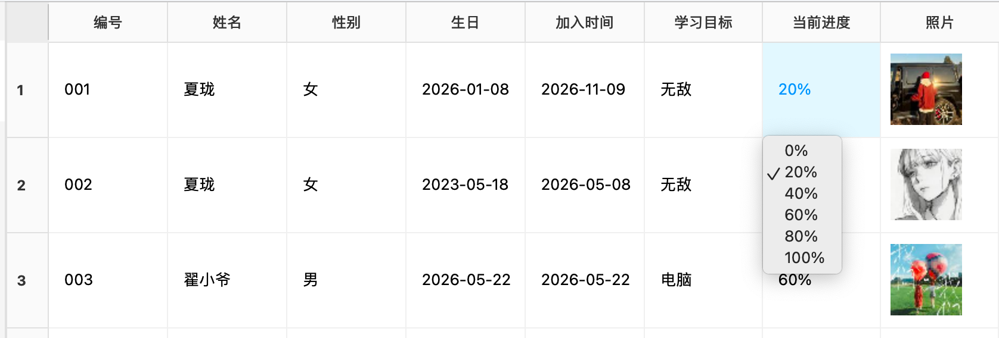

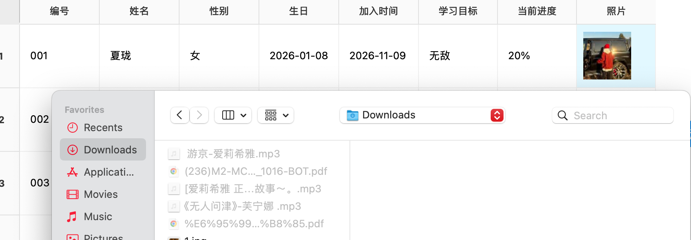

#### 3.课程安排

年份从2020到2031，会自动获取当天现在的时间，自动计算周数，点击添加课程双击即可修改，点击上一周下一周侧边栏会自动计算对应星期几的月份，另外可以选择多个课程一起删除，添加只能单个单添加

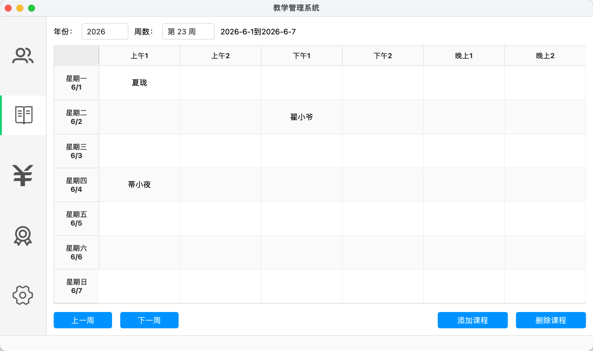

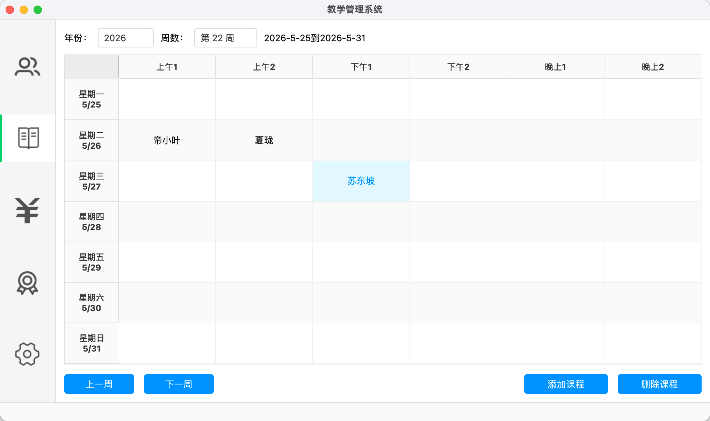

#### 4.财务

QTableWidget里的数据关联着学生信息里的数据，根据存在的学生添加数据，饼状图是根据支付类型来实现的(金额是总金额)、折线图是根据日期和金额所绘制

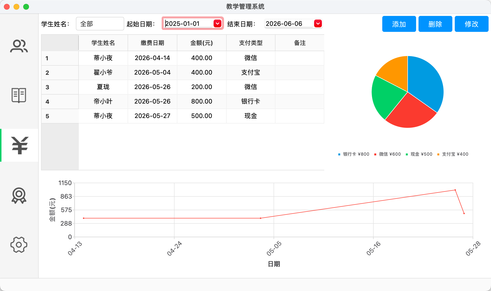

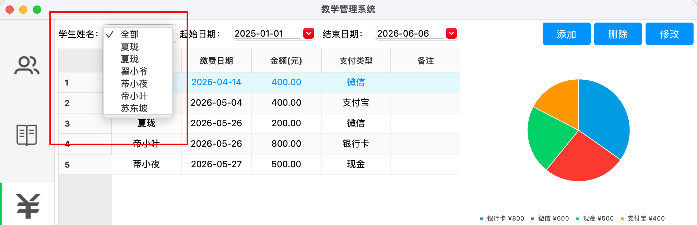

##### 4.1添加（修改的弹框和添加一样）删除点击对应数据在点击“删除”即可

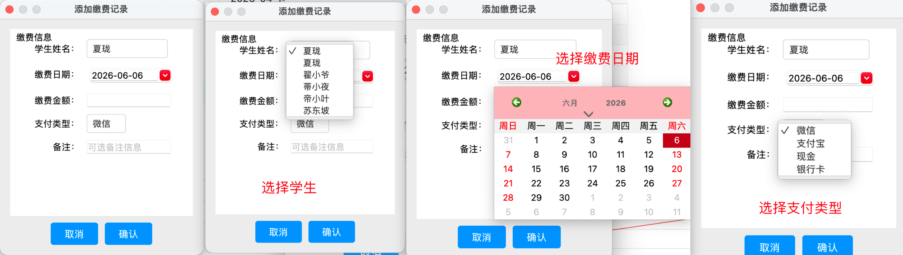

#### 5.荣誉墙

“添加、修改、删除”，这里可以把荣誉奖图片放入，我这里用图片代替里，删除和修改得选择对应项，图片会自动缩放填充整个框

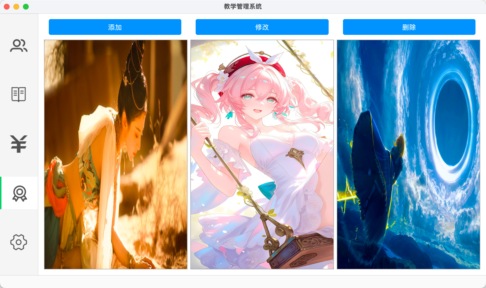

#### 6.设置

用 QSettings 类，配置文件保存在 `config/app.ini`

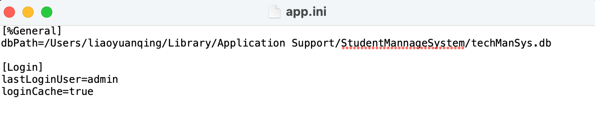

实现数据库路径修改和用户账户密码修改

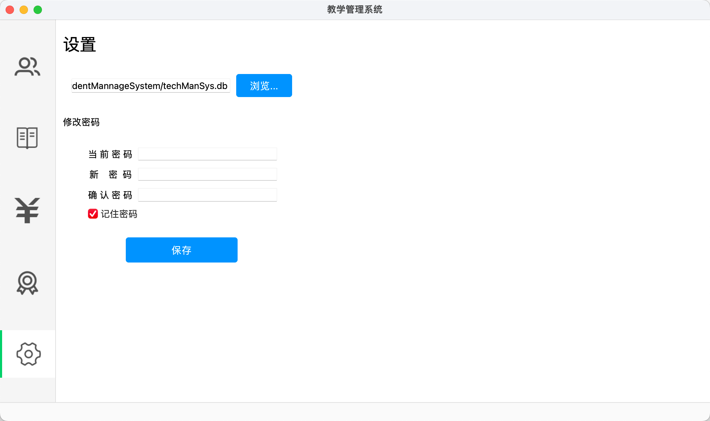